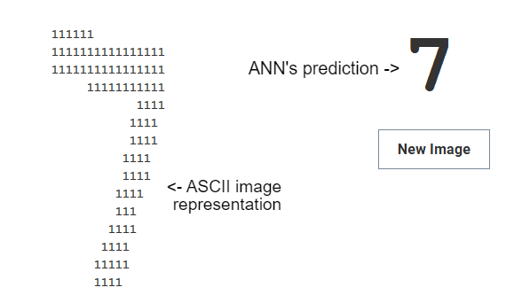

# Handwriting-Recognition

A Supervised Learning Artificial Neural Network model for recognizing handwritten digits. 
The number of hidden layers, nodes per hidden layer, and the learning rate are customizable.
  
No external libraries, training/test data from [MNIST database](http://yann.lecun.com/exdb/mnist/).
