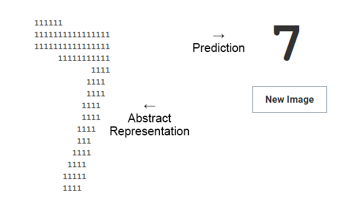

# Handwriting Recognition
## Background -
[*Artificial Neural Networks (ANNs)*](https://en.wikipedia.org/wiki/Artificial_neural_network) propagate inputs through a network of connections, simulating a neural "spike train." Artificial Neurons process inputs, yielding the neuron's *action potential* *. These values propagate through the network until reaching the final (output) layer. Each node in the output layer represents an output value. The output node with the greatest action potential is the most likely result. Training the network involves [backpropagation](https://en.wikipedia.org/wiki/Backpropagation): the finetuning of action-potential calculations by manipulating *weights*, a property unique to each neuronal connection.
|  | </img> |
| :--: | :--: |
| *Multilayered ANN Highlighting Neuronal Connections* | *Inputs → Activation Function → Action Potential* |

*Biologically, an action potential is a threshold that determines whether a neighboring neuron fires. Artificially, action potential represents a neuron's strength.
## Preview -

 
No external libraries, training/test data sourced from the [MNIST database](http://yann.lecun.com/exdb/mnist/).
